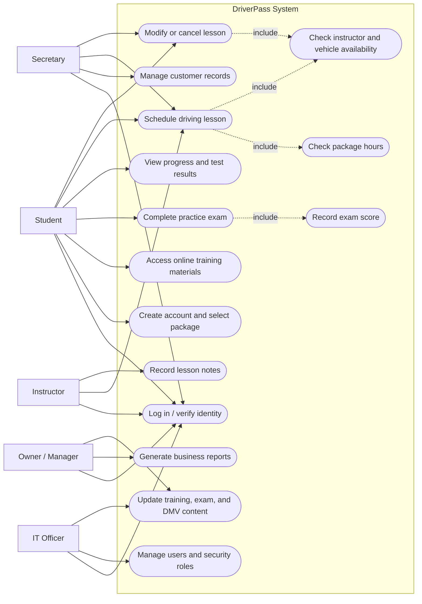
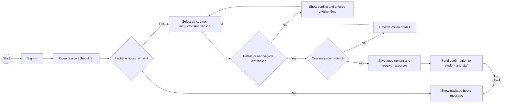
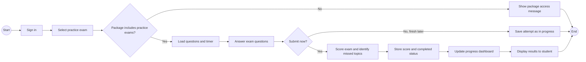
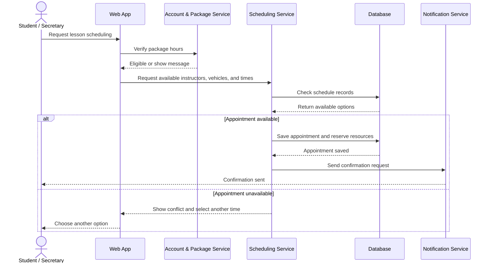
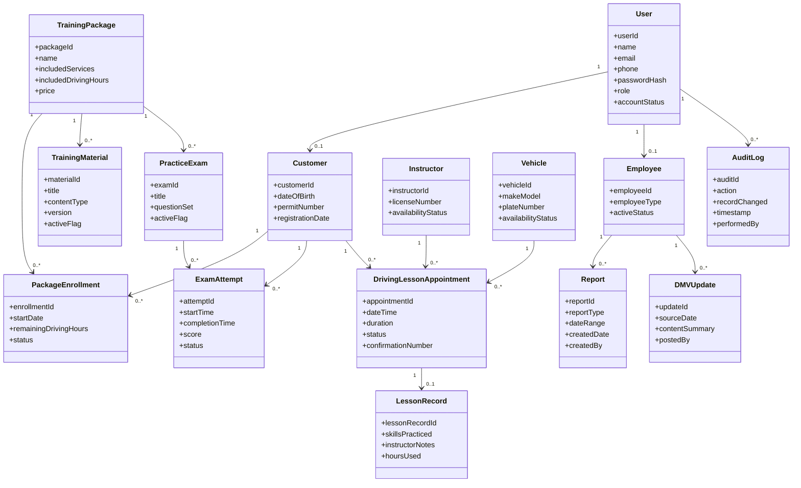

# CS 255 System Design Document

## DriverPass System

Roderick L. Hughey  
CS 255: System Analysis and Design  
August 16, 2026

## Design Focus

This document turns the DriverPass business needs into a practical system design that developers can use. The design supports online training, practice exams, driving lesson scheduling, lesson notes, progress tracking, reporting, and controlled employee access from one central web-based system.

## System Design Overview

- The system gives students one place to create an account, choose a package, complete online work, schedule lessons, and view progress.
- Secretaries can manage customer records and lesson scheduling without bypassing package limits or vehicle and instructor availability.
- Instructors can review schedules, record lesson results, and provide notes that update the student progress record.
- Management can update training content, review reports, and make informed decisions from centralized records.
- The IT officer can manage accounts, roles, backups, audit logs, and system configuration while protecting student data.

# UML Diagrams

## UML Use Case Diagram

The use case diagram shows the major work that students, staff, management, and IT need to complete in the DriverPass system. It keeps the design tied to actual business needs instead of only showing screens.

## UML Activity Diagram: Schedule Driving Appointment

The first activity diagram breaks down the driving lesson scheduling process. The corrected flow prevents a failed package check, scheduling conflict, or declined confirmation from reaching a saved appointment. This matters because DriverPass must avoid double-booking students, instructors, vehicles, and time slots.

## UML Activity Diagram: Complete Practice Exam

The second activity diagram breaks down the practice exam process. It checks package access before the exam opens, separates saving an attempt from submitting an attempt, records the final score, and updates progress after submission.

## UML Sequence Diagram: Schedule Driving Appointment

The sequence diagram shows the communication needed to schedule a driving appointment. It uses an alternate path to show what happens when the requested time is available and what happens when it is not. This is important because the system must stop two people from reserving the same limited resource at the same time.

## UML Class Diagram

The class diagram shows the main records the system needs and how they connect. It includes the customer, package, practice exam, lesson appointment, instructor, vehicle, lesson record, report, audit, and content update records needed for the proposed DriverPass system.

# Technical Requirements

| Area | Technical Requirement | Reason for Requirement |
|---|---|---|
| Hardware | Cloud-hosted web and application servers sized for at least 200 concurrent customer sessions and 25 concurrent staff or administrator sessions. | Supports launch demand and allows growth without rebuilding the system. |
| Hardware | Centralized database server or managed database service for users, packages, schedules, lessons, tests, reports, audit logs, and configuration records. | Keeps official records in one reliable place and prevents conflicting spreadsheets or paper records. |
| Hardware | Encrypted backup storage in a separate availability zone or storage location. | Protects student records, schedule history, lesson notes, and business reports if the main system fails. |
| Software | Responsive web application compatible with current and previous major versions of Chrome, Edge, Firefox, and Safari. | Supports desktops, tablets, and phones without requiring a separate native app for the first release. |
| Software | Server-side business logic for account validation, package eligibility, scheduling, scoring, reporting, and audit logging. | Prevents users from bypassing rules and keeps schedule decisions consistent across screens. |
| Software | Relational database management system with transaction support and indexed schedule, reservation, and account tables. | Prevents double-booked students, instructors, vehicles, and time slots during appointment changes. |
| Tools | UML modeling tool such as Lucidchart for maintaining use case, activity, sequence, and class diagrams. | Gives analysts, developers, and the client a shared picture of the system before implementation. |
| Tools | Version control, issue tracking, automated testing, and controlled deployment tools. | Keeps changes traceable, reduces regressions, and supports safer releases. |
| Infrastructure | HTTPS with TLS 1.2 or later, identity management, role-based access control, and multifactor authentication for privileged accounts. | Protects login credentials and limits access to sensitive business and student information. |
| Infrastructure | Monitoring and alerts for failed backups, repeated login failures, scheduling errors, unavailable services, and critical application failures. | Helps the IT officer respond before small problems become business-stopping issues. |
| Infrastructure | Incremental backups at least every 15 minutes, nightly full backups, a 15-minute recovery point target, and a 4-hour recovery time target. | Limits data loss and downtime after technical failures or mistakes. |
| Infrastructure | 99.5% monthly uptime target excluding announced maintenance, with planned maintenance limited to two hours per month when possible. | Sets a clear reliability expectation while still allowing planned updates. |

## Requirement Traceability Notes

- The account and role design supports students, the secretary, instructors, administrators, the owner, and the IT officer.
- The scheduling design supports package-hour rules and prevents confirmed double-booking for students, instructors, vehicles, and time slots.
- The practice-test design records test name, start time, completion time, score, and status so progress can be reported accurately.
- The reporting design supports on-screen review and downloadable data while official updates stay in the central system.
- First-release limitations remain clear: full offline editing, native mobile apps, direct DMV integration, payment processing, SMS reminders, and mapping can be added later if DriverPass approves the scope.

## Reference

Southern New Hampshire University. (n.d.). *DriverPass interview transcript* [Course document].
